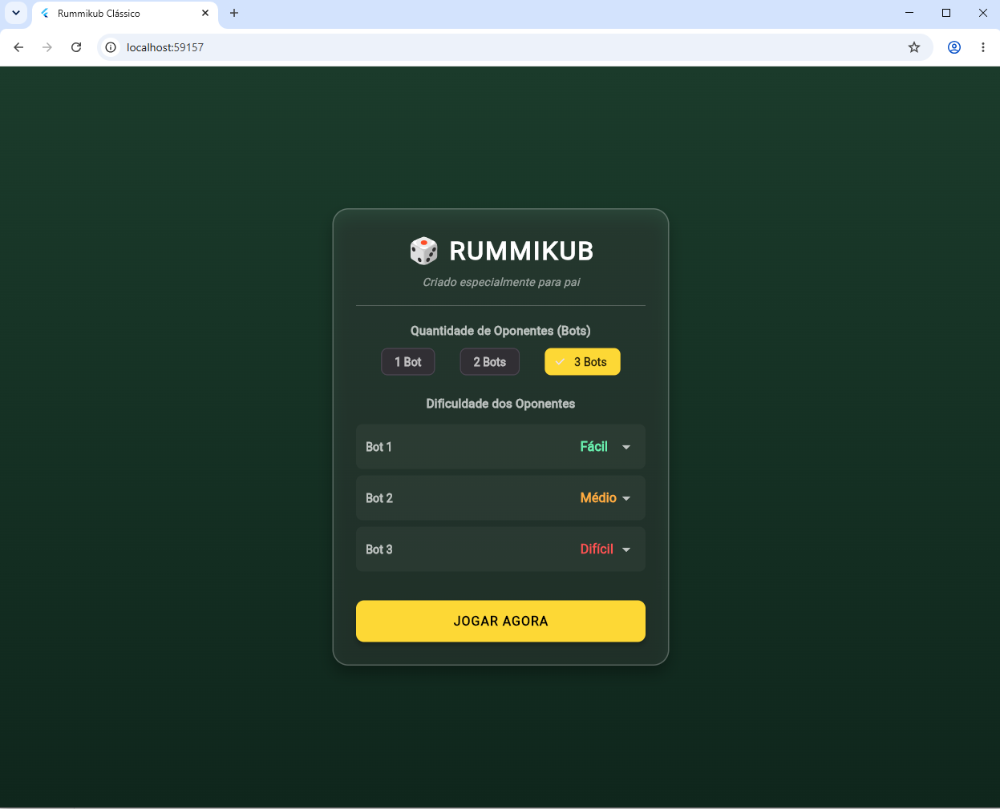
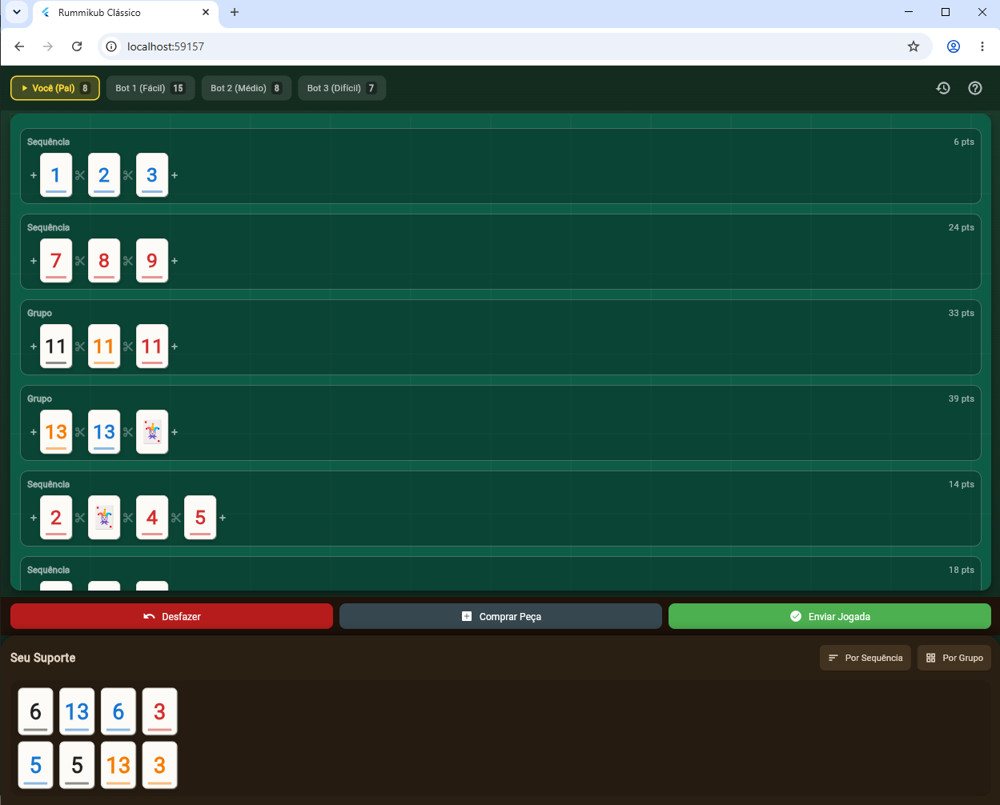

# Rummikub 🎲

Uma adaptação digital do clássico jogo de tabuleiro Rummikub, construída inteiramente com Flutter! Este projeto implementa as mecânicas principais do Rummikub, permitindo que você jogue contra adversários controlados por inteligência artificial em diferentes níveis de dificuldade.

## 🌟 Funcionalidades

- **Regras Clássicas:** Implementação das regras padrões do Rummikub (sequências, grupos, descida inicial de 30 pontos).
- **Adversários IA:** Jogue contra bots com diferentes dificuldades (Fácil, Médio, Difícil).
- **Interface Responsiva:** Interface intuitiva baseada em "arrastar e soltar" (drag-and-drop).
- **Multiplataforma:** Desenvolvido com Flutter, pronto para ser compilado para celular, web e desktop.

## 📸 Capturas de Tela





## 🚀 Como Executar

Para rodar o projeto localmente, certifique-se de ter o Flutter instalado na sua máquina.

1. Clone o repositório
```bash
git clone https://github.com/matheusmonteiro15/Rummikub.git
```
2. Baixe as dependências
```bash
flutter pub get
```
3. Execute o app
```bash
flutter run
```

## 🛠️ Tecnologias Utilizadas

- [Flutter](https://flutter.dev/) - Framework de UI multiplataforma.
- [Dart](https://dart.dev/) - Linguagem de programação principal.

## 📝 Licença

Este projeto tem código aberto e está disponível para uso pessoal e exibição no portfólio.
